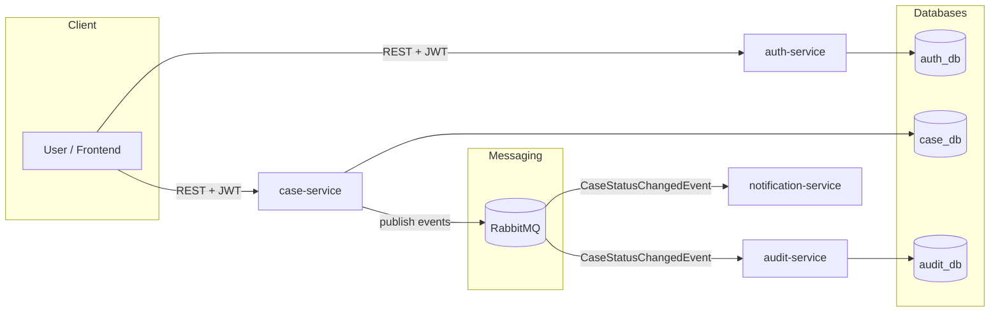

# Gov-Case-Flow (CaseFlow) — Backend


**Gov-Case-Flow** is a **case management system** for public administration (GovTech-like).  
It supports creating and tracking official cases (**sprawy urzędowe**) with **status workflow**, **audit trail**, and **event-driven communication**.

The backend is implemented as **microservices** using **Spring Boot**, **PostgreSQL**, **RabbitMQ**, and **Docker Compose**.

---

## 🧩 Microservices

This repository contains a Maven multi-module backend:

- **auth-service** — registration, login, JWT authentication & authorization
- **case-service** — case CRUD, status workflow, assigning cases to users, status history
- **audit-service** — audit trail (stores received domain events)
- **notification-service** — receives events (currently logs them, planned: real notifications)
- **gov-case-flow-events** — shared module with event contracts (DTOs) used between services

---

## 🏗️ Architecture

Services communicate using **RabbitMQ (event-driven architecture)**.

### Mermaid diagram (microservices + RabbitMQ)



##  ⚙️ Tech stack
- Java 17
- Spring Boot
- Spring Security + JWT
- PostgreSQL 17
- RabbitMQ 3 (management)
- Liquibase
- Maven multi-module
- Docker + Docker Compose
- GitHub Actions CI
- Build & Test on JDK 17 and JDK 21 (matrix)
- Docker image build for all services (Buildx + cache)

## ✅ Features

### Auth
- user registration
- user login
- JWT-based authentication / authorization

### Case management
- create case
- update case (PATCH)
- delete case
- get single case / list cases (pagination)
- assign case to user
- validated status transitions (workflow)
- status history persistence
- publishes domain events (RabbitMQ)

### Audit
- listens for domain events
- stores audit trail in PostgreSQL

### Notifications
- listens for domain events
- currently logs received events (planned: email/in-app notifications)

## ⚡ Run locally (Docker)
Run the project locally in a few minutes using Docker Compose (no manual DB setup required).

### 1️⃣ Clone the repository 

```bash

git clone https://github.com/bartlomiejlorenowicz/Gov-Case-Flow-backend.git
cd Gov-Case-Flow-backend
```


### 2️⃣ Start the application

```bash

docker compose up --build
```
This will start:

PostgreSQL databases (auth_db, case_db, audit_db)

RabbitMQ (with management UI)

Spring Boot microservices (auth-service, case-service, audit-service, notification-service)

```

3️⃣ Access the application

- Case Service Swagger UI: http://localhost:8080/swagger-ui/index.html

- Auth Service Swagger UI: http://localhost:8081/swagger-ui/index.html

- RabbitMQ Management UI: http://localhost:15672

### Services & ports:
| Service | Port (host → container) | Notes |
|--------|-------------------------|------|
| case-service | `8080 → 8080`           | REST API + Actuator |
| auth-service | `8081 → 8080`           | REST API + Actuator |
| audit-service | `8082 → 8080`           | REST API + Swagger + Actuator |
| notification-service | -                       | internal service + Actuator |
| postgres (case_db) | `5432 → 5432`           | case-service DB |
| audit-postgres (audit_db) | `5433 → 5432`           | audit-service DB |
| auth-postgres (auth_db) | `5434 → 5432`           | auth-service DB |
| rabbitmq | `5672`, `15672`         | AMQP + Management UI |

### Healthchecks
Docker Compose includes healthchecks:

- PostgreSQL: pg_isready
- Services: GET /actuator/health

## 📚 Swagger / OpenAPI

Swagger UI is available per service:

- **Case Service:** http://localhost:8080/swagger-ui/index.html
- **Auth Service:** http://localhost:8081/swagger-ui/index.html
- **Audit Service:** http://localhost:8082/swagger-ui/index.html

## 🔑 Configuration
Configuration is provided via .env (see .env.example) and docker-compose.yml.

## 🔌 API (high-level)

Swagger UI:
- **Case Service:** http://localhost:8080/swagger-ui/index.html
- **Auth Service:** http://localhost:8081/swagger-ui/index.html

### Main endpoints (examples)

**Auth (auth-service)**
- `POST /auth/register` — register user
- `POST /auth/login` — login and obtain JWT

**Cases (case-service)**
- `POST /cases` — create case
- `GET /cases` — list cases (pagination)
- `PATCH /cases/{id}` — change status

Exact endpoints may vary depending on controller implementation.

## 🧪 CI / Quality

This repository uses **GitHub Actions CI** pipeline:

- Build & test on **JDK 17 and JDK 21** (matrix)
- Maven dependencies caching enabled
- Docker images built for all microservices (**Buildx + GitHub Actions cache**)

Workflow file:
- `.github/workflows/ci.yml`

## 👤 Author
Created by Bartłomiej Lorenowicz
